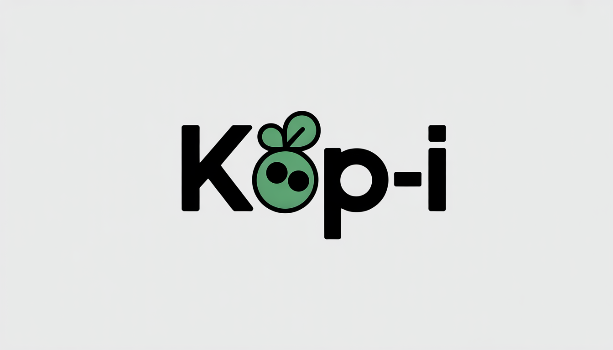

<p align="center">
  
</p>

# kop-i

A modern, lightweight clipboard manager with AI capabilities

kop-i is a cross-platform clipboard manager that combines ease of use, security, and artificial intelligence. Inspired by Maccy for macOS, kop-i brings advanced features to all major platforms while maintaining a lightweight architecture thanks to Node.js and Neutralino.js.

## Development Setup

```bash
# 1. Clona il repository
git clone <repository-url>
cd kop-i

# 2. npm project iniit
npm init -y

# 3. Neutralino CLI global installation
npm install -g @neutralinojs/neu

# 4. Neutralino installation check
neu --version

# 5. Scaffolding
mkdir -p src/{core,ui,data,utils} resources/{icons,styles} tests docs

# 6. TypeScript dev dependecies
npm install --save-dev typescript @types/node

# 7. TypeScript init
npx tsc --init

# 8. Neutralino project creation
neu create kop-i

# 9. npm dependencies
npm install

# 10. Running app
neu run / npm run dev
```
## Commit convention
```
Initial setup
git commit -m "chore: setup project scaffolding"

Function
git commit -m "feat: implement clipboard history capture"

Bug fixing
git commit -m "fix: prevent duplicate entries in history"

README update
git commit -m "docs: add installation instructions"
```
## Roadmap

### Phase 0 – Preparation
- [x] GitHub repository creation
- [x] Visual identity definition (logo, naming)
- [x] Folder structure setup (src, UI, data, resources)
- [x] Technology stack configuration (Node.js + Neutralino.js)
- [x] Development environment setup

### Phase 1 – MVP (Basic Clipboard Manager)
**Goal**: Create a functional, stable, and minimal clipboard manager inspired by Maccy.

- [ ] **Clipboard history**: Automatic capture of text (and optionally images), stores last 50 items
- [ ] **Lightweight popup UI**: Window callable with global shortcut to view history
- [ ] **Select and paste**: Click or shortcut to copy a selected item again
- [ ] **Basic search**: Real-time history filtering while typing
- [ ] **Local storage**: Data persistence with JSON files or SQLite
- [ ] **Cross-platform**: Native operation on Windows/macOS/Linux without Chromium

### Phase 2 – Security and Protection
**Goal**: Protect user's sensitive data.

- [ ] **Local authentication**: Optional password to access history
- [ ] **History encryption**: Encrypted data on disk
- [ ] **Smart exclusion**: Ability to exclude sensitive clips from history
- [ ] **Protected shortcuts**: Secure management of global shortcuts
- [ ] **Roles and permissions**: Preparation for future multi-user or synchronization

### Phase 3 – AI Integration (Ollama)
**Goal**: Add intelligence to the clipboard to improve productivity.

- [ ] **Clean paste**: Automatic removal of unwanted formatting
- [ ] **Automatic snippets**: Identification of repetitive content and template suggestions
- [ ] **Intelligent categorization**: Automatic tags for text, code, links, emails, etc.
- [ ] **Semantic search**: Find clips by meaning, not just keywords
- [ ] **Smart suggestions**: Auto-completion or optimized versions of clips

### Phase 4 – Advanced Features
**Goal**: Expand capabilities beyond basic clipboard.

- [ ] **Advanced image management**: Screenshots, drag-and-drop, thumbnails, preview
- [ ] **Favorites/Pin**: Frequent or important clips always on top
- [ ] **Multi-device sync**: Secure and encrypted exchange between multiple machines
- [ ] **Proactive AI**: Contextual suggestions based on usage patterns and frequent content
- [ ] **Extensions**: Plugin system for custom features

### Phase 5 – Distribution and Community
**Goal**: Make kop-i accessible and build a community.

- [ ] **npm package/installer**: Simple distribution for all platforms
- [ ] **Complete documentation**: User guides, API docs, practical examples
- [ ] **Open-source governance**: Issue management, public roadmap, external contributions
- [ ] **Branding and website**: Online presence with dedicated domain
- [ ] **Community building**: Forum, Discord, blog with tips & tricks

## Tech Stack

- **Runtime**: Node.js
- **GUI Framework**: Neutralino.js (lightweight, native)
- **Database**: SQLite / JSON (to be defined)
- **AI Engine**: Ollama (local)
- **Language**: TypeScript / JavaScript (to be defined)

## Installation

_Coming soon - The project is in early development_

## Contributing

kop-i is an open source project and welcomes contributions! More details coming in the next phases.

## License

[See LICENSE](LICENSE)

## Project Status

**Current phase**: Phase 0 - Preparation

The project is in the early stages of development. Follow this repository for updates!

---

